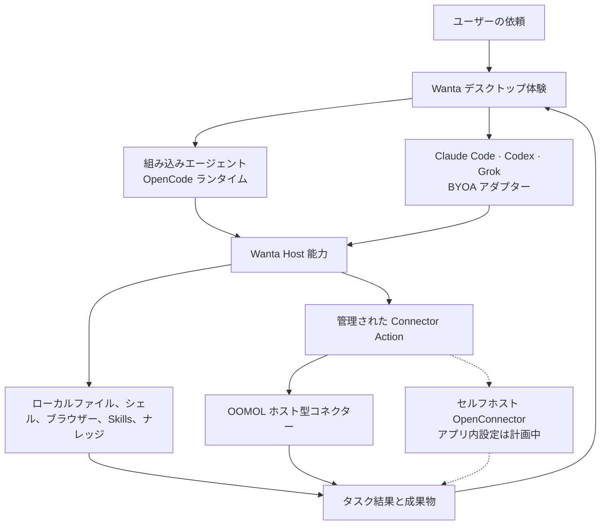

<div align="center">

[English](README.md) · [简体中文](README.zh-CN.md) · **日本語** · [Español](README.es.md) · [한국어](README.ko.md)


# Wanta

**モデル、エージェント、業務アプリ、チームを自分で選べる、オープンなデスクトップ Agent Host。**

Wanta ホストモデルまたは独自の OpenAI 互換 API キーで組み込みエージェントを実行できます。
既存のローカルアカウント、ネイティブモデルカタログ、利用枠を維持したまま Claude Code、Codex、
Grok を持ち込むこともできます。Wanta はローカルツール、Skills、ブラウザー、ナレッジ、管理された
アプリ接続、可視化された実行、成果物をひとつのクロスプラットフォーム環境にまとめます。
1,400+ の主要アプリに接続し、日常的に使うサービスを同じ Agent ワークフローへ取り込めます。

[Web サイト](https://wanta.ai/) · [OpenConnector](https://github.com/oomol-lab/open-connector) ·
[ドキュメント](docs/project-overview.md) · [開発ガイド](docs/development.md)

[](LICENSE)


</div>

<p align="center">
  
</p>

<p align="center"><em>接続サービスのタスクから再利用可能なインタラクティブ成果物までを、ひとつのワークスペースで。</em></p>

<p align="center"><strong>BYOK モデル · BYOA エージェント · 1,400+ の主要アプリ · チーム権限ルール</strong></p>

## Wanta を選ぶ理由

Wanta は [OOMOL](https://oomol.com/) が、モデル、Agent Harness、インテグレーション、権限を
ひとつの閉じた製品に縛られず、Agent スタック全体を自分で管理したいユーザーと開発者のために
構築しています。

| 自分で管理するもの | Wanta が提供するもの                                                                                                                                     |
| ------------------ | -------------------------------------------------------------------------------------------------------------------------------------------------------- |
| **モデル**         | Wanta ホストモデル、または独自の OpenAI 互換 API キーで組み込みエージェントを実行。                                                                      |
| **エージェント**   | 組み込みエージェント、Claude Code、Codex、Grok を同じデスクトップ Host で利用。外部エージェントはネイティブのローカルアカウント、モデル、利用枠を維持。  |
| **業務アプリ**     | 日常業務を幅広くカバーする 1,400+ の主要アプリに接続し、10,000+ の構築済み Action を段階的に探索。何千ものツールをモデルコンテキストへ読み込まずに利用。 |
| **チーム**         | 個人・チームワークスペースを切り替え、Connections と Skills を共有し、Action 単位の名前付き権限ルールを割り当て。                                        |

Wanta はプロジェクト、ローカルツール、Skills、ブラウザー、ナレッジ、Connections、権限、
可視化されたツール操作、成果物といった移植可能な Host 能力を提供します。各外部エージェントは
固有のネイティブ能力を維持し、UI は実際に宣言された能力だけを表示します。

Wanta は再利用可能なオープンソースのデスクトップ基盤でもあります。フォークしてプロンプト、
ツール、コネクター、UI、ブランドを置き換え、独自の製品やワークフロー向けエージェントを
リリースできます。

Wanta をそのまま利用することもできます。独自の OpenAI 互換モデルでローカル実行するか、
サインインして OOMOL がホストするモデル、コネクター、OAuth 認証、チームワークスペースを
利用できます。

## Wanta をオープンソース化した理由

説得力のあるエージェントデモは、モデルとチャット入力だけでも始められます。しかし、人が
安心して使えるデスクトップエージェントには、ランタイムのライフサイクル管理、ストリーミング
イベント、ローカルアクセス制御、安全なモデル認証情報、セッションとプロジェクト、ツール操作、
ファイル成果物、リカバリー、パッケージング、自律的な処理を理解できる UI などが必要です。

開発者は、エージェント独自の能力に取り組む前に、これらすべてを作り直すべきではありません。
Wanta は完全なデスクトップ基盤を公開し、次のことを可能にします。

- 複数のエージェントランタイムを、能力駆動のデスクトップ体験でホストする
- ドメイン固有のツール、Skills、プロンプト、ワークフローを構築する
- ローカルコンピューター上の作業と認証済み SaaS 操作を組み合わせる
- 開発者向けプロトタイプではなく、独自ブランドのデスクトップ製品を配布する
- 運用するインフラの範囲を自分で選ぶ

## 構築できるもの

Wanta は現在、汎用ワークエージェントですが、アーキテクチャはカスタマイズを前提としています。
運用、調査、サポート、EC、企業ナレッジ向けのエージェント、社内ツール、その他の業界特化型
デスクトップ製品へ発展させられます。

| 最初から備わっているもの                                           | 独自にカスタマイズできるもの                               |
| ------------------------------------------------------------------ | ---------------------------------------------------------- |
| 組み込み OpenCode ランタイムと Claude Code、Codex、Grok アダプター | レジストリ型アダプター層からコーディングエージェントを追加 |
| ローカルファイル、シェル、スクリプト、検索、Web アクセス           | 製品、業界、社内システム向けツールを追加                   |
| OpenAI 互換カスタムモデルと OOMOL ホストモデル                     | 独自のモデルカタログと既定プロバイダーを導入               |
| ストリーミングチャット、ツール操作、承認、質問、添付ファイル       | ランタイム連携を保ちながらワークフローを再設計             |
| 生成物の成果物管理                                                 | 製品固有の出力、プレビュー、操作を追加                     |
| クロスプラットフォーム Electron パッケージングと更新               | 独自の名称、アイデンティティ、配布、リリース手順を適用     |
| OpenConnector 互換の SaaS Action 検索・実行                        | 独自 Provider またはホスト型コネクターエコシステムに接続   |

## Wanta の動作を見る

Wanta は推論、プロジェクトやファイルの調査、コマンドやスクリプトの実行、Web アクセスを
直接行い、非公開アカウントデータが必要なタスクでは認証済み SaaS Action を利用できます。
ツール実行は会話にストリーミングされ、エージェントの作業内容をユーザーが確認できます。

リスクの高いローカル操作は明示的な権限フローを通過します。情報が不足している場合、
エージェントは構造化された質問で処理を一時停止できます。Build と Plan モードは異なる
実行契約を持ち、タスクごとにモデル、推論レベル、プロジェクト、アクセスモードを選択できます。

生成ファイルは会話の中に埋もれず、タスクに添付されたまま残ります。Wanta はコード、テキスト、
画像、PDF、Word 文書、完全に操作可能なスプレッドシートを成果物パネルで開いて確認できます。

オプションのホスト型機能は、保存済み Provider 認証情報をエージェントに渡すことなく、管理された
アカウント接続とチームワークスペースを追加します。チームは Connections と Skills を共有し、
複数の名前付き権限ルールを作成してメンバーを割り当て、ルールごとに Action を制限できます。

## 独自のエージェントを持ち込む

Wanta では組み込みエージェント、Claude Code、Codex、Grok の 4 種類を選択できます。組み込み
エージェントは Wanta のモデルカタログと BYOK を利用します。外部エージェントは独自のローカル
CLI で認証し、ネイティブの Provider ルート、モデルカタログ、利用枠だけを使用します。Wanta の
アカウントトークン、BYOK キー、Base URL、モデルエイリアスが外部エージェントへ渡ることはありません。

| エージェント         | モデルとアカウントの所有者                                | Wanta Host 能力                                                       |
| -------------------- | --------------------------------------------------------- | --------------------------------------------------------------------- |
| 組み込みエージェント | Wanta ホストモデルまたは独自の OpenAI 互換 BYOK 設定      | Wanta ランタイムと Host の完全な統合                                  |
| Claude Code          | ローカル Claude Code アカウントとネイティブモデルカタログ | プロジェクト、Skills、Connections、ブラウザー、ナレッジ、権限、成果物 |
| Codex                | ローカル Codex アカウントとネイティブモデルカタログ       | プロジェクト、Skills、Connections、ブラウザー、ナレッジ、権限、成果物 |
| Grok                 | ローカル Grok アカウントとネイティブモデルカタログ        | プロジェクト、Skills、Connections、ブラウザー、ナレッジ、権限、成果物 |

BYOA 層は正規化されたデフォルト拒否のアダプター契約を使用します。新しい ACP 統合はレジストリ
経由で追加され、能力宣言と契約テストがランタイム動作と UI の整合性を保ちます。

## 業務アプリを接続する

Wanta は OpenConnector の共有エコシステムを通じて、コミュニケーション、生産性、開発ツール、
分析、コマース、ストレージなどを含む 1,400+ の主要アプリと 10,000+ の構築済み Action に接続します。
日常的に使うサービスを幅広くカバーしながら、Provider ごとの大量のツールをプロンプトに登録せず、
アプリ一覧、Action 検索、スキーマ確認、入力検証、Connector 境界での実行を段階的に行います。

Provider の OAuth トークンと API 認証情報は OOMOL Connector または独自の OpenConnector
デプロイに留まります。エージェントが受け取るのはタスクに必要なメタデータと結果であり、保存済み
の秘密情報ではありません。同じ管理されたフローをすべての対応エージェントで利用できます。

## チームで業務を管理する

セッション、Connections、Skills、権限を混在させることなく、個人と複数のチームワークスペースを
切り替えられます。チームの作成者と管理者は Connection をチーム全体に共有するか、名前付きルールを
作成し、メンバーを割り当て、ルールごとに許可する Action や Provider 固有のアクセス範囲を制限できます。
一般メンバーに表示されるのはポリシーで許可された Connections だけです。

不正なポリシーは閉じた状態で失敗し、同時編集はバージョン保護された書き込みを使用します。

## 利用方法を選ぶ

Wanta は、オープンソースのデスクトップ基盤とオプションのホストサービスを分離しています。
運用したい範囲に合う方法を選択してください。

| 目的                                                     | 推奨方法                                                                                                 |
| -------------------------------------------------------- | -------------------------------------------------------------------------------------------------------- |
| 独自モデルでプライベートなデスクトップエージェントを実行 | **Local BYOK** ワークスペースを使用。Wanta アカウントは不要です。                                        |
| 独自製品向けデスクトップエージェントを構築               | Wanta をフォークし、エージェント、ツール、モデル、UI、ブランドをカスタマイズ。                           |
| 独自の OpenConnector デプロイに接続                      | 現在は互換エンドポイント向けにディストリビューションをビルド可能。アプリ内セルフホスト設定は計画中です。 |
| マネージドモデルと認証済み SaaS 接続を使用               | Wanta にサインインし、OOMOL ホストサービスを使用。                                                       |
| コネクター、Skills、アクセス、使用量をチームで共有       | ホスト型 Wanta チームワークスペースを使用。                                                              |

### ランタイムモード

| モード                    | アカウント         | モデル                                                          | ローカルツール | コネクター      | チーム機能     |
| ------------------------- | ------------------ | --------------------------------------------------------------- | -------------- | --------------- | -------------- |
| Local BYOK                | 不要               | 組み込みエージェント + OpenAI 互換 Provider                     | 利用可         | 利用不可        | なし           |
| Wanta hosted              | 必要               | 組み込みは OOMOL モデルまたは BYOK、BYOA はネイティブアカウント | 利用可         | OOMOL Connector | あり           |
| Self-hosted OpenConnector | アプリ対応は計画中 | モデル・エージェント選択とは独立                                | 利用可         | 計画中          | デプロイで定義 |

サインアウト後や OOMOL セッション失効後も、ローカルのセッション、プロジェクト、モデル設定は
利用できます。Wanta がローカルセッションを無断で OOMOL チームワークスペースへアップロードする
ことはありません。

現在の `WANTA_ENDPOINT` は**ビルド時のディストリビューション設定**であり、エンドユーザー向けの
ランタイムスイッチではありません。Connector Base URL だけでなく、互換サービス環境全体を
決定します。セルフホスト OpenConnector 用のアプリレベル Base URL とオプションの Runtime Token
フローは、近日提供予定の画面として表示されていますが、まだ完成していません。

## 独自のデスクトップエージェントをカスタマイズして配布

Wanta は組み込みエージェントの固定ランタイムとして OpenCode を使用し、BYOA アダプター層から
外部エージェントをサポートします。メインプロセスはセッションルーティングと移植可能な Host 能力を
所有し、各アダプターは実際に対応するランタイムネイティブ能力を維持します。

### エージェントエンジン：OpenCode

アプリは固定バージョンの `opencode-ai@1.18.21` バイナリをループバック専用の
`opencode serve` Sidecar として起動し、`@opencode-ai/sdk@1.18.21` から操作します。
OpenCode パッケージは MIT ライセンスで、[THIRD_PARTY_NOTICES.md](THIRD_PARTY_NOTICES.md)
に記載されています。API は安定版として扱われないため、ランタイム、SDK、プラグインを同じ
正確なバージョンに固定しています。

主な拡張ポイント：

| 領域                                     | 参照先                                                               |
| ---------------------------------------- | -------------------------------------------------------------------- |
| エージェントのアイデンティティと動作契約 | [`electron/agent/system-prompt.ts`](electron/agent/system-prompt.ts) |
| モード、モデル、ツール、権限             | [`electron/agent/config.ts`](electron/agent/config.ts)               |
| コネクターとドメイン固有ツール           | [`electron/agent/tool-sources.ts`](electron/agent/tool-sources.ts)   |
| 組み込み・カスタムモデル対応             | [`electron/models/`](electron/models/)                               |
| チャットと成果物の体験                   | [`src/routes/Chat/`](src/routes/Chat/)                               |
| 接続体験                                 | [`src/routes/Connections/`](src/routes/Connections/)                 |
| アプリケーションのアイデンティティ       | [`electron/branding.ts`](electron/branding.ts)                       |

エージェントの能力は、有効なツール、権限ルール、システムプロンプトの 3 か所に表現される
ひとつの製品契約です。ランタイムの動作、安全性、UI の期待が一致するよう、必ず同時に変更して
ください。これらの境界を変更する前に、[アーキテクチャガイド](docs/architecture.md)と
[コード規約](docs/conventions.md)をお読みください。

## 仕組み



Wanta はモデルコンテキストへ何百もの Provider 固有ツールを登録せず、段階的な探索を行います。

```text
接続済みアプリを一覧表示 → Action を検索 → スキーマを確認 → 検証済みパラメーターで実行
```

これによりツール範囲を小さく保ち、Action の契約を明確にし、認証エラーを自由形式のモデル文では
なく構造化された製品状態として返せます。

### OpenCode、OpenConnector、Wanta、OOMOL

- **OpenCode** は Wanta 組み込みエージェントの固定ランタイムです。Wanta がライフサイクルを
  管理し、モデル、設定、権限、プロンプト、カスタムツールを提供します。
- **Claude Code、Codex、Grok** は BYOA ランタイムです。ネイティブのローカル認証、モデル
  カタログ、利用枠、エージェント動作を維持しながら Wanta Host 能力を利用します。
- **OpenConnector** は共有コネクターエコシステムの Provider を構築・実行するオープンソースの
  姉妹プロジェクトです。
- **Wanta** はデスクトップエージェント製品であり、このリポジトリの再利用可能なアプリ基盤です。
- **OOMOL** は、サインイン、モデル、コネクター認証情報、OAuth、チーム、Skills、使用量、
  請求、配布のためのオプションのホスト層を提供します。

Local BYOK のコア機能に OOMOL アカウントは不要です。サインインするとホスト型コネクターと
チーム機能が有効になりますが、デスクトップアプリの閲覧、フォーク、開発には必要ありません。

プロセス、信頼境界、IPC、ストリーミング、認証、ストレージ設計の詳細は
[アーキテクチャガイド](docs/architecture.md)をご覧ください。

## ソースから実行

必要環境：Node.js 22.22.2 以降と、Corepack 経由の pnpm。Node.js 25 以降には Corepack が
同梱されないため、`corepack` がない場合は先にインストールしてください。

```bash
npm install --global corepack@latest
```

```bash
git clone https://github.com/oomol-lab/wanta.git
cd wanta
corepack pnpm install
corepack pnpm run dev
```

これがリポジトリを試す最短手順です。環境設定、テストコマンド、ランタイム検証、パッケージング、
署名、リリースフローは[開発ガイド](docs/development.md)をご覧ください。

## セキュリティとデータ境界

- OpenCode はループバックのみで待ち受け、プロセスごとにランダムなサーバーパスワードを使用します。
- OOMOL セッショントークンとカスタムモデル API キーは別々に保存・管理されます。
- カスタムモデルキーは Electron `safeStorage` で暗号化され、レンダラープロセスへ返されません。
- Claude Code、Codex、Grok は各自のローカル CLI で認証し、Wanta は生の認証情報を読み取りも保存もしません。
- コネクター認証情報は選択したホスト環境または自前運用環境に留まり、エージェントは保存済みの
  Provider 認証情報ではなく Action の結果だけを受け取ります。
- リスクの高いローカル操作は Wanta の明示的な承認 UI に接続されます。
- ローカルセッションが無断で OOMOL チームワークスペースへアップロードされることはありません。

脆弱性の非公開報告については [SECURITY.md](SECURITY.md)、完全な信頼境界については
[アーキテクチャガイド](docs/architecture.md)をご覧ください。

## プロジェクト構成

| パス                                       | 用途                                                                  |
| ------------------------------------------ | --------------------------------------------------------------------- |
| [`electron/`](electron/)                   | メインプロセス、Preload、エージェントランタイム、デスクトップサービス |
| [`src/`](src/)                             | React レンダラー、ルート、Hooks、UI コンポーネント                    |
| [`scripts/`](scripts/)                     | 開発、バイナリ準備、パッケージング、リリース支援                      |
| [`resources/`](resources/)                 | アプリに同梱するブランド素材とリソース                                |
| [`docs/`](docs/)                           | 製品、アーキテクチャ、開発、規約、意思決定の記録                      |
| [`.github/workflows/`](.github/workflows/) | Pull Request とリリースの自動化                                       |

技術スタックは Electron 42、Vite 8、React 19、Tailwind CSS 4、OpenCode、TypeScript、
Vitest、oxlint、oxfmt です。Wanta は macOS、Windows、Linux 向けにパッケージ化できます。

## ドキュメント

- [プロジェクト概要](docs/project-overview.md) — 製品範囲とエコシステムの関係
- [アーキテクチャ](docs/architecture.md) — プロセス、ランタイム、IPC、ストリーミング、認証、データフロー
- [開発ガイド](docs/development.md) — インストール、実行、テスト、パッケージ、署名、リリース
- [コード規約](docs/conventions.md) — 実装ルールとセキュリティ境界
- [主要な技術判断](docs/key-decisions.md) — このアーキテクチャになった理由
- [コントリビューションガイド](CONTRIBUTING.md) — ブランチ、Pull Request、検証、コントリビューションルール
- [セキュリティポリシー](SECURITY.md) — 脆弱性の非公開報告
- [商標ポリシー](TRADEMARKS.md)と[サードパーティ通知](THIRD_PARTY_NOTICES.md)

## コントリビューション

Issue と Pull Request を歓迎します。動作や UI に大きな変更を加える前に Issue を作成し、
製品の方向性と範囲について合意してください。Pull Request を作成する前に
[CONTRIBUTING.md](CONTRIBUTING.md)をお読みください。リポジトリのワークフロー、必要な検証、
コントリビューションで維持すべきセキュリティ境界が記載されています。

コントリビューションを提出すると、書面で明記しない限り、Apache License 2.0 の下で提供する
ことに同意したものとみなされます。

## ライセンスの範囲

別途記載がない限り、このリポジトリ向けに作成されたソースコード、スクリプト、テスト、文書は
[Apache License 2.0](LICENSE)の下でライセンスされます。

このライセンスは、それぞれの権利者が所有する第三者の製品、サービス、API、商標、商号、ロゴ、
アイコン、スクリーンショット、その他の素材に対する権利を許諾するものではありません。第三者の
名称と素材は識別および相互運用の目的でのみ使用されており、掲載は推奨、支援、提携を意味しません。
