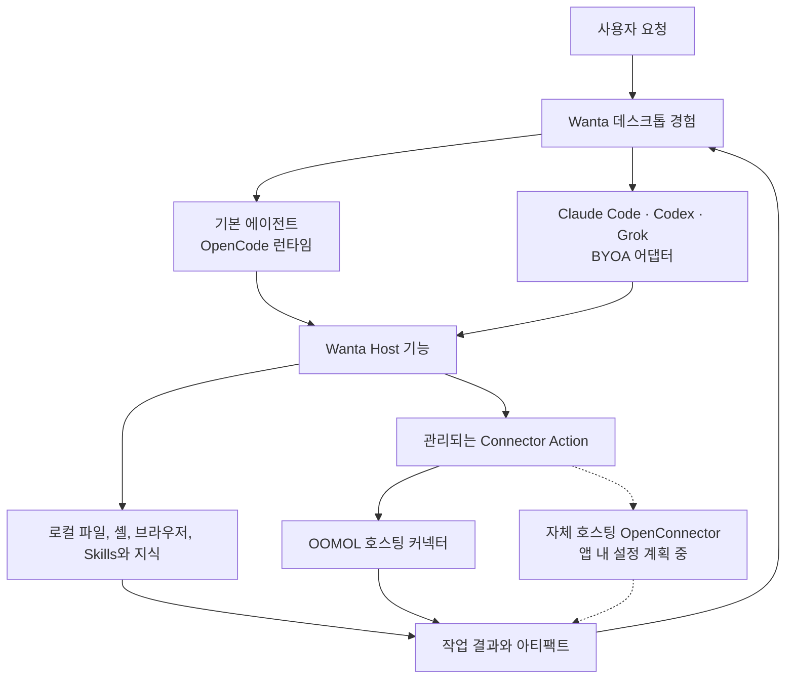

<div align="center">

[English](README.md) · [简体中文](README.zh-CN.md) · [日本語](README.ja.md) · [Español](README.es.md) · **한국어**


# Wanta

**내 모델, 내 에이전트, 내 업무 앱과 팀을 위한 개방형 데스크톱 Agent Host입니다.**

Wanta 호스팅 모델이나 자체 OpenAI 호환 API 키로 기본 에이전트를 실행하세요. 기존 로컬 계정,
네이티브 모델 카탈로그와 사용량을 유지한 채 Claude Code, Codex, Grok을 연결할 수도 있습니다.
Wanta는 로컬 도구, Skills, 브라우저, 지식, 관리되는 앱 연결, 실행 과정과 아티팩트를 하나의
크로스 플랫폼 작업 환경으로 제공합니다. 1,400+개의 주요 앱을 연결해 평소 사용하는 서비스를
하나의 Agent 워크플로에 포함할 수 있습니다.

[웹사이트](https://wanta.ai/) · [OpenConnector](https://github.com/oomol-lab/open-connector) ·
[문서](docs/project-overview.md) · [개발 가이드](docs/development.md)

[](LICENSE)


</div>

<p align="center">
  
</p>

<p align="center"><em>하나의 작업 공간에서 연결 서비스 작업을 재사용 가능한 대화형 아티팩트로 전환합니다.</em></p>

<p align="center"><strong>BYOK 모델 · BYOA 에이전트 · 1,400+ 주요 앱 · 팀 권한 규칙</strong></p>

## Wanta를 선택하는 이유

Wanta는 모델, Agent Harness, 통합과 권한을 하나의 폐쇄형 제품에 묶지 않고 전체 에이전트
스택을 직접 제어하려는 사용자와 개발자를 위해 [OOMOL](https://oomol.com/)이 만들었습니다.

| 직접 제어하는 것 | Wanta가 제공하는 것                                                                                                                             |
| ---------------- | ----------------------------------------------------------------------------------------------------------------------------------------------- |
| **모델**         | Wanta 호스팅 모델 또는 자체 OpenAI 호환 API 키로 실행하는 기본 에이전트.                                                                        |
| **에이전트**     | 기본 에이전트, Claude Code, Codex, Grok을 하나의 Host에서 사용. 외부 에이전트는 로컬 계정, 모델과 사용량을 유지.                                |
| **업무 앱**      | 일상 업무를 폭넓게 다루는 1,400+개의 주요 앱을 연결하고, 수천 개 도구를 컨텍스트에 넣지 않은 채 10,000+개의 사전 구축 Action을 단계적으로 검색. |
| **팀**           | 개인·팀 워크스페이스 전환, Connections와 Skills 공유, Action 단위의 이름 있는 권한 규칙.                                                        |

Wanta는 프로젝트, 로컬 도구, Skills, 브라우저, 지식, Connections, 권한, 표시되는 도구 활동과
아티팩트 같은 이식 가능한 Host 기능을 제공합니다. 각 외부 에이전트는 고유한 네이티브 기능을
유지하며, UI는 실제로 선언된 기능만 표시합니다.

Wanta는 재사용 가능한 오픈 소스 데스크톱 기반이기도 합니다. 포크한 뒤 프롬프트, 도구,
커넥터, 인터페이스와 브랜드를 교체하여 자신의 제품에 맞는 에이전트를 출시할 수 있습니다.

Wanta를 그대로 사용할 수도 있습니다. 자체 OpenAI 호환 모델로 로컬에서 실행하거나, 로그인하여
OOMOL 호스팅 모델, 커넥터, OAuth 인증과 팀 워크스페이스를 이용하세요.

## Wanta를 오픈 소스로 공개한 이유

설득력 있는 에이전트 데모는 모델과 채팅 입력만으로 시작할 수 있습니다. 하지만 사용자가 믿고
쓸 수 있는 데스크톱 에이전트에는 런타임 수명 주기 관리, 스트리밍 이벤트, 로컬 접근 제어,
안전한 모델 자격 증명, 세션과 프로젝트, 도구 활동, 파일 아티팩트, 복구, 패키징, 자율 작업을
이해할 수 있게 만드는 UI 등 훨씬 많은 요소가 필요합니다.

개발자가 에이전트만의 고유한 기능을 만들기도 전에 이 모든 것을 다시 구현할 필요는 없습니다.
Wanta는 완전한 데스크톱 기반을 공개하여 다음을 가능하게 합니다.

- 여러 에이전트 런타임을 기능 기반 데스크톱 경험에서 호스팅
- 도메인별 도구, Skills, 프롬프트와 워크플로 구축
- 로컬 컴퓨터 작업과 인증된 SaaS 액션 결합
- 개발자용 프로토타입이 아닌 자체 브랜드 데스크톱 제품 배포
- 직접 운영할 인프라의 범위 선택

## 만들 수 있는 것

현재 Wanta는 범용 작업 에이전트지만, 아키텍처는 목적에 맞게 변경할 수 있도록 설계되었습니다.
운영, 리서치, 고객 지원, 이커머스, 기업 지식 에이전트나 내부 도구, 기타 분야별 데스크톱 제품으로
발전시킬 수 있습니다.

| 기본 제공                                              | 원하는 방식으로 변경                             |
| ------------------------------------------------------ | ------------------------------------------------ |
| 기본 OpenCode 런타임과 Claude Code, Codex, Grok 어댑터 | 레지스트리 기반 계층으로 다른 코딩 에이전트 추가 |
| 로컬 파일, 셸, 스크립트, 검색과 웹 접근                | 제품, 업계 또는 내부 시스템을 위한 도구 추가     |
| OpenAI 호환 커스텀 모델과 OOMOL 호스팅 모델            | 자체 모델 카탈로그와 기본 공급자 적용            |
| 스트리밍 채팅, 도구 활동, 승인, 질문과 첨부 파일       | 런타임 연동을 유지하면서 워크플로 재설계         |
| 생성 결과를 위한 아티팩트 처리                         | 제품별 출력, 미리보기와 작업 추가                |
| 크로스 플랫폼 Electron 패키징과 업데이트               | 자체 이름, 정체성, 배포 및 릴리스 절차 적용      |
| OpenConnector 호환 SaaS 액션 검색과 실행               | 자체 Provider 또는 호스팅 커넥터 생태계 연결     |

## Wanta 작동 모습

Wanta는 직접 추론하고, 프로젝트와 파일을 살펴보고, 명령과 스크립트를 실행하고, 웹에 접근하며,
비공개 계정 데이터가 필요한 작업에는 인증된 SaaS 액션을 사용할 수 있습니다. 도구 실행 과정이
대화에 스트리밍되므로 사용자는 에이전트가 무엇을 하는지 확인할 수 있습니다.

위험도가 높은 로컬 작업은 명시적인 권한 흐름을 거칩니다. 정보가 부족하면 에이전트가 구조화된
질문으로 작업을 일시 중지할 수도 있습니다. Build와 Plan 모드는 서로 다른 실행 계약을 제공하며,
작업마다 모델, 추론 수준, 프로젝트와 접근 모드를 선택할 수 있습니다.

생성된 파일은 대화 속에서 사라지지 않고 작업에 계속 첨부됩니다. Wanta는 아티팩트 패널에서 코드,
텍스트, 이미지, PDF, Word 문서와 완전한 대화형 스프레드시트 통합 문서를 열고 검토할 수 있습니다.

선택형 호스팅 기능은 저장된 Provider 자격 증명을 에이전트에 전달하지 않으면서 관리된 연결과
팀 워크스페이스를 추가합니다. 팀은 Connections와 Skills를 공유하고, 이름 있는 권한 규칙을
여러 개 만들고, 구성원을 배정하고, 규칙별 Action을 제한할 수 있습니다.

## 나만의 에이전트 가져오기

Wanta에서는 기본 에이전트, Claude Code, Codex, Grok의 네 가지 에이전트를 선택할 수 있습니다.
기본 에이전트는 Wanta 모델 카탈로그와 BYOK를 사용합니다. 외부 에이전트는 자체 로컬 CLI로
인증하고 네이티브 Provider 경로, 모델 카탈로그와 사용량만 사용합니다. Wanta 계정 토큰,
BYOK 키, Base URL이나 모델 별칭은 외부 에이전트에 주입되지 않습니다.

| 에이전트      | 모델과 계정 소유자                                | Wanta Host 기능                                               |
| ------------- | ------------------------------------------------- | ------------------------------------------------------------- |
| 기본 에이전트 | Wanta 호스팅 모델 또는 자체 OpenAI 호환 BYOK 설정 | Wanta 런타임과 Host 전체 통합                                 |
| Claude Code   | 로컬 Claude Code 계정과 네이티브 모델 카탈로그    | 프로젝트, Skills, Connections, 브라우저, 지식, 권한, 아티팩트 |
| Codex         | 로컬 Codex 계정과 네이티브 모델 카탈로그          | 프로젝트, Skills, Connections, 브라우저, 지식, 권한, 아티팩트 |
| Grok          | 로컬 Grok 계정과 네이티브 모델 카탈로그           | 프로젝트, Skills, Connections, 브라우저, 지식, 권한, 아티팩트 |

BYOA 계층은 정규화된 기본 거부 어댑터 계약을 사용합니다. 새 ACP 통합은 레지스트리로 추가되며,
기능 선언과 계약 테스트가 런타임 동작과 UI 제어의 일관성을 유지합니다.

## 업무 앱 연결

Wanta는 OpenConnector 공유 생태계를 통해 커뮤니케이션, 생산성, 개발 도구, 분석, 커머스,
스토리지 등 1,400+개의 주요 앱과 10,000+개의 사전 구축 Action을 연결합니다. 일상적으로 사용하는
서비스를 폭넓게 지원하면서도 각 프롬프트에 거대한 도구 목록을 등록하지 않고, 에이전트가 앱 조회,
Action 검색, 스키마 검사, 입력 검증과 Connector 경계에서의 실행을 단계적으로 수행합니다.

Provider OAuth 토큰과 API 자격 증명은 OOMOL Connector 또는 자체 OpenConnector 배포에 남습니다.
에이전트는 작업에 필요한 메타데이터와 결과만 받고 저장된 비밀 정보는 받지 않습니다. 같은 관리형
흐름을 모든 지원 에이전트에서 사용할 수 있습니다.

## 팀으로 업무 관리

세션, Connections, Skills나 권한을 섞지 않고 개인 공간과 여러 팀 워크스페이스를 전환할 수
있습니다. 팀 생성자와 관리자는 Connection을 팀 전체에 공유하거나 이름 있는 규칙을 만들고,
구성원을 배정하고, 허용 Action과 Provider별 접근 범위를 제한할 수 있습니다. 일반 구성원은
정책이 허용한 Connections만 볼 수 있습니다.

잘못된 정책은 닫힌 상태로 실패하며, 동시 편집은 버전 보호 쓰기로 최신 변경을 보호합니다.

## 사용 방식 선택

Wanta는 오픈 소스 데스크톱 기반과 선택형 호스팅 서비스를 분리합니다. 직접 운영하려는 범위에 맞는
방식을 선택하세요.

| 목표                                             | 권장 방식                                                                                   |
| ------------------------------------------------ | ------------------------------------------------------------------------------------------- |
| 자체 모델로 비공개 데스크톱 에이전트 실행        | **Local BYOK** 워크스페이스를 사용하세요. Wanta 계정이 필요 없습니다.                       |
| 자체 제품용 데스크톱 에이전트 구축               | Wanta를 포크하고 에이전트, 도구, 모델, UI와 브랜드를 커스터마이즈하세요.                    |
| 자체 OpenConnector 배포 연결                     | 현재 호환 엔드포인트용 배포판을 빌드할 수 있습니다. 앱 내 자체 호스팅 설정은 계획 중입니다. |
| 관리형 모델과 인증된 SaaS 연결 사용              | Wanta에 로그인하여 OOMOL 호스팅 서비스를 사용하세요.                                        |
| 커넥터, Skills, 접근 권한과 사용량을 팀에서 공유 | 호스팅 Wanta 팀 워크스페이스를 사용하세요.                                                  |

### 런타임 모드

| 모드                      | 계정 필요       | 모델                                         | 로컬 도구 | 커넥터          | 팀 기능       |
| ------------------------- | --------------- | -------------------------------------------- | --------- | --------------- | ------------- |
| Local BYOK                | 아니요          | 기본 에이전트 + OpenAI 호환 Provider         | 예        | 사용할 수 없음  | 아니요        |
| Wanta hosted              | 예              | 기본은 OOMOL 또는 BYOK, BYOA는 네이티브 계정 | 예        | OOMOL Connector | 예            |
| Self-hosted OpenConnector | 앱 지원 계획 중 | 모델 및 에이전트 선택과 독립                 | 예        | 계획 중         | 배포에서 정의 |

로그아웃하거나 OOMOL 세션이 만료되어도 로컬 세션, 프로젝트와 모델 설정은 계속 사용할 수 있습니다.
Wanta는 로컬 세션을 사용자 모르게 OOMOL 팀 워크스페이스에 업로드하지 않습니다.

현재 `WANTA_ENDPOINT` 옵션은 최종 사용자의 런타임 전환 옵션이 아니라 **빌드 시점 배포 설정**입니다.
Connector Base URL 하나뿐 아니라 전체 호환 서비스 환경을 결정합니다. 자체 호스팅 OpenConnector를
위한 애플리케이션 수준 Base URL과 선택형 Runtime Token 흐름은 향후 제공 화면으로 표시되어 있지만
아직 완성되지 않았습니다.

## 나만의 데스크톱 에이전트 커스터마이즈 및 배포

Wanta는 OpenCode를 기본 에이전트의 고정 런타임으로 사용하고 BYOA 어댑터 계층을 통해 외부
에이전트를 지원합니다. 메인 프로세스는 세션 라우팅과 이식 가능한 Host 기능을 담당하며,
각 어댑터는 실제로 지원하는 런타임 네이티브 기능을 유지합니다.

### 에이전트 엔진: OpenCode

애플리케이션은 고정된 `opencode-ai@1.18.21` 바이너리를 루프백 전용 `opencode serve`
사이드카로 시작하고 `@opencode-ai/sdk@1.18.21`을 통해 제어합니다. OpenCode 패키지는 MIT
라이선스를 사용하며 [THIRD_PARTY_NOTICES.md](THIRD_PARTY_NOTICES.md)에 고지되어 있습니다.
API를 안정적인 것으로 간주하지 않기 때문에 런타임, SDK와 플러그인을 정확히 같은 버전으로 고정합니다.

가장 중요한 확장 지점은 다음과 같습니다.

| 영역                             | 시작 위치                                                            |
| -------------------------------- | -------------------------------------------------------------------- |
| 에이전트 정체성과 작동 계약      | [`electron/agent/system-prompt.ts`](electron/agent/system-prompt.ts) |
| 에이전트 모드, 모델, 도구와 권한 | [`electron/agent/config.ts`](electron/agent/config.ts)               |
| 커넥터 및 도메인별 도구          | [`electron/agent/tool-sources.ts`](electron/agent/tool-sources.ts)   |
| 기본 및 커스텀 모델 지원         | [`electron/models/`](electron/models/)                               |
| 채팅과 아티팩트 경험             | [`src/routes/Chat/`](src/routes/Chat/)                               |
| 연결 경험                        | [`src/routes/Connections/`](src/routes/Connections/)                 |
| 애플리케이션 정체성              | [`electron/branding.ts`](electron/branding.ts)                       |

에이전트 기능은 활성화된 도구, 권한 규칙, 시스템 프롬프트라는 세 위치에 표현된 하나의 제품 계약입니다.
런타임 동작, 안전과 UI 기대가 일치하도록 세 가지를 함께 변경하세요. 이 경계를 변경하기 전에
[아키텍처 가이드](docs/architecture.md)와 [코드 규칙](docs/conventions.md)을 읽어 주세요.

## 작동 방식



Wanta는 모델 컨텍스트에 수백 개의 Provider별 도구를 등록하지 않고 단계적 탐색을 사용합니다.

```text
연결된 앱 목록 조회 → Action 검색 → 스키마 확인 → 검증된 매개변수로 실행
```

이를 통해 도구 표면을 작게 유지하고, Action 계약을 명확히 하며, 인증 실패를 자유 형식의 모델 텍스트가
아닌 구조화된 제품 상태로 반환할 수 있습니다.

### OpenCode, OpenConnector, Wanta와 OOMOL

- **OpenCode**는 Wanta 기본 에이전트의 고정 런타임입니다. Wanta가 수명 주기를 관리하고 모델,
  구성, 권한, 프롬프트와 커스텀 도구를 제공합니다.
- **Claude Code, Codex, Grok**은 BYOA 런타임입니다. 네이티브 로컬 인증, 모델 카탈로그,
  사용량과 에이전트 동작을 유지하면서 Wanta Host 기능을 사용합니다.
- **OpenConnector**는 공유 커넥터 생태계에서 Provider를 구축하고 실행하기 위한 오픈 소스 자매 프로젝트입니다.
- **Wanta**는 데스크톱 에이전트 제품이자 이 저장소의 재사용 가능한 애플리케이션 기반입니다.
- **OOMOL**은 로그인, 모델, 커넥터 자격 증명, OAuth, 팀, Skills, 사용량, 결제와 배포를 위한 선택형
  호스팅 계층을 제공합니다.

Local BYOK 핵심 기능은 OOMOL 계정이 필요하지 않습니다. 로그인하면 호스팅 커넥터와 팀 계층이
활성화되지만 데스크톱 애플리케이션을 살펴보고, 포크하고, 개발하는 데에는 필요하지 않습니다.

전체 프로세스, 신뢰 경계, IPC, 스트리밍, 인증과 저장소 설계는
[아키텍처 가이드](docs/architecture.md)를 참고하세요.

## 소스에서 실행

요구 사항: Node.js 22.22.2 이상과 Corepack을 통한 pnpm. Node.js 25 이상에는 Corepack이
포함되지 않으므로 `corepack`이 없다면 먼저 설치하세요.

```bash
npm install --global corepack@latest
```

```bash
git clone https://github.com/oomol-lab/wanta.git
cd wanta
corepack pnpm install
corepack pnpm run dev
```

저장소를 사용해 보는 가장 짧은 방법입니다. 환경 구성, 테스트 명령, 런타임 검증, 패키징, 서명과
릴리스 워크플로는 [개발 가이드](docs/development.md)를 참고하세요.

## 보안과 데이터 경계

- OpenCode는 루프백에서만 수신하고 프로세스마다 무작위 서버 비밀번호를 사용합니다.
- OOMOL 세션 토큰과 커스텀 모델 API 키는 별도로 저장되고 수명 주기도 분리됩니다.
- 커스텀 모델 키는 Electron `safeStorage`로 암호화되며 렌더러에 반환되지 않습니다.
- Claude Code, Codex, Grok은 각자의 로컬 CLI로 인증하며 Wanta는 원본 자격 증명을 읽거나 저장하지 않습니다.
- 커넥터 자격 증명은 선택한 호스팅 또는 자체 운영 환경에 남고, 에이전트는 저장된 Provider 자격 증명이 아닌 액션 결과만 받습니다.
- 위험도가 높은 로컬 작업은 Wanta의 명시적 승인 UI로 연결됩니다.
- 로컬 세션은 사용자 모르게 OOMOL 팀 워크스페이스에 업로드되지 않습니다.

비공개 취약점 신고는 [SECURITY.md](SECURITY.md), 전체 신뢰 경계는
[아키텍처 가이드](docs/architecture.md)를 참고하세요.

## 프로젝트 구조

| 경로                                       | 목적                                                       |
| ------------------------------------------ | ---------------------------------------------------------- |
| [`electron/`](electron/)                   | 메인 프로세스, 프리로드, 에이전트 런타임과 데스크톱 서비스 |
| [`src/`](src/)                             | React 렌더러, 라우트, 훅과 UI 컴포넌트                     |
| [`scripts/`](scripts/)                     | 개발, 바이너리 준비, 패키징과 릴리스 지원                  |
| [`resources/`](resources/)                 | 애플리케이션에 포함되는 브랜드와 리소스                    |
| [`docs/`](docs/)                           | 제품, 아키텍처, 개발, 규칙과 의사 결정 기록                |
| [`.github/workflows/`](.github/workflows/) | Pull Request와 릴리스 자동화                               |

기술 스택은 Electron 42, Vite 8, React 19, Tailwind CSS 4, OpenCode, TypeScript, Vitest,
oxlint와 oxfmt입니다. Wanta는 macOS, Windows와 Linux용으로 패키징됩니다.

## 문서

- [프로젝트 개요](docs/project-overview.md) — 제품 범위와 생태계 관계
- [아키텍처](docs/architecture.md) — 프로세스, 런타임, IPC, 스트리밍, 인증과 데이터 흐름
- [개발 가이드](docs/development.md) — 설치, 실행, 테스트, 패키징, 서명과 릴리스
- [코드 규칙](docs/conventions.md) — 구현 규칙과 보안 경계
- [주요 기술 결정](docs/key-decisions.md) — 아키텍처가 현재 형태인 이유
- [기여 가이드](CONTRIBUTING.md) — 브랜치, Pull Request, 검증과 기여 규칙
- [보안 정책](SECURITY.md) — 비공개 취약점 신고
- [상표 정책](TRADEMARKS.md)과 [서드파티 고지](THIRD_PARTY_NOTICES.md)

## 기여하기

Issue와 Pull Request를 환영합니다. 동작이나 UI를 크게 변경하기 전에 먼저 Issue를 열어 제품 방향과
범위에 합의해 주세요. Pull Request를 열기 전에 [CONTRIBUTING.md](CONTRIBUTING.md)를 읽어 주세요.
저장소 워크플로, 필수 검증과 기여 시 유지해야 하는 보안 경계가 설명되어 있습니다.

기여를 제출하면 서면으로 달리 명확하게 밝히지 않는 한 Apache License 2.0에 따라 제공하는 데
동의한 것으로 간주됩니다.

## 라이선스 범위

달리 명시되지 않는 한 이 저장소를 위해 작성된 소스 코드, 스크립트, 테스트와 문서는
[Apache License 2.0](LICENSE)에 따라 라이선스됩니다.

이 라이선스는 각 권리자가 소유한 서드파티 제품, 서비스, API, 상표, 상호, 로고, 아이콘,
스크린샷 또는 기타 자료에 대한 권리를 부여하지 않습니다. 서드파티 이름과 자료는 식별과 상호 운용
목적으로만 사용되며, 포함되었다고 해서 보증, 후원 또는 파트너십을 의미하지 않습니다.
