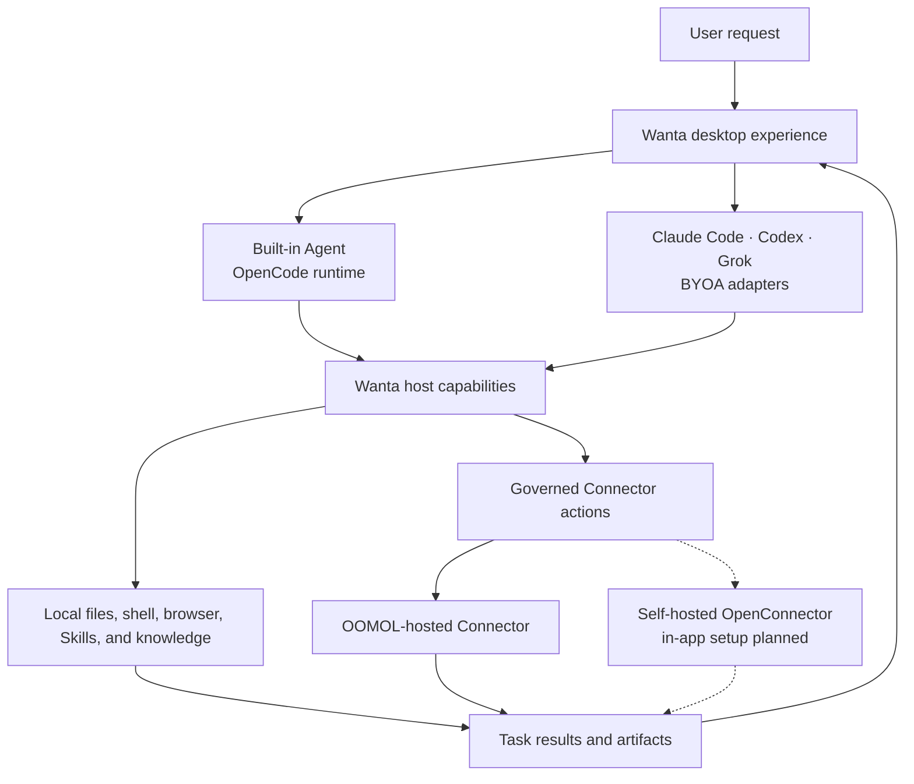

<div align="center">

**English** · [简体中文](README.zh-CN.md) · [日本語](README.ja.md) · [Español](README.es.md) · [한국어](README.ko.md)


# Wanta

**An open desktop host for your models, your agents, your work apps, and your teams.**

Run the built-in Agent with Wanta-hosted models or your own OpenAI-compatible API key. Or bring
Claude Code, Codex, and Grok with their existing local accounts, native model catalogs, and usage
quotas. Wanta gives every supported Agent one cross-platform workspace for local tools, Skills,
browser and knowledge access, governed connections to 1,400+ popular apps, visible execution, and
artifacts—so the services you already use can become part of the same Agent workflow.

[Website](https://wanta.ai/) · [OpenConnector](https://github.com/oomol-lab/open-connector) ·
[Documentation](docs/project-overview.md) · [Development Guide](docs/development.md)

[](LICENSE)


</div>

<p align="center">
  
</p>

<p align="center"><em>From a connected-service task to a reusable, interactive artifact in one workspace.</em></p>

<p align="center"><strong>BYOK Models · BYOA Agents · 1,400+ Popular Apps · Team Permission Rules</strong></p>

## Why Wanta

Wanta is built by [OOMOL](https://oomol.com/) for people who want control over the full Agent stack—not
another product that binds the model, Agent harness, integrations, and permissions together.

| Keep control of    | What Wanta provides                                                                                                                                                                     |
| ------------------ | --------------------------------------------------------------------------------------------------------------------------------------------------------------------------------------- |
| **Your models**    | Use Wanta-hosted models or run the built-in Agent with your own OpenAI-compatible API key.                                                                                              |
| **Your Agents**    | Use the built-in Agent, Claude Code, Codex, or Grok in the same desktop host. External Agents keep their native local accounts, models, and quotas.                                     |
| **Your work apps** | Connect 1,400+ popular apps across the services you use every day, with 10,000+ prebuilt Actions discovered progressively instead of loading thousands of tools into the model context. |
| **Your teams**     | Switch between personal and team workspaces, share Connections and Skills, and assign named permission rules with Action-level access.                                                  |

Wanta provides the portable host capabilities—projects, local tools, Skills, browser, knowledge,
Connections, permissions, visible tool activity, and artifacts. Each external Agent keeps the native
capabilities that make it distinct. The UI follows the capabilities an Agent actually declares instead
of pretending every Agent supports the same controls.

Wanta is also a reusable open-source desktop foundation. Fork it, replace the prompt, tools,
connectors, interface, and brand, then ship an Agent for your own product or workflow.

You can also use Wanta as it is: run locally with your own OpenAI-compatible model, or sign in to use
OOMOL-hosted models, connectors, OAuth authorization, and team workspaces.

## Why We Open-Sourced Wanta

A convincing Agent demo can begin with a model and a chat input. A desktop Agent people can rely on
needs much more: runtime lifecycle management, streaming events, local access controls, secure model
credentials, sessions and projects, tool activity, file artifacts, recovery, packaging, and a UI that
makes autonomous work understandable.

Developers should not have to rebuild all of that before working on the capability that makes their
Agent unique. Wanta opens up the complete desktop foundation so you can:

- host multiple Agent runtimes behind one capability-driven desktop experience;
- build domain-specific tools, Skills, prompts, and workflows;
- combine local computer work with authenticated SaaS actions;
- distribute a branded desktop product instead of a developer-only prototype;
- choose how much infrastructure to operate yourself.

## What You Can Build

Wanta is a general work Agent today, but the architecture is intended to be adapted. It can become an
operations Agent, research Agent, support Agent, ecommerce Agent, enterprise knowledge Agent, internal
tool, or another vertical desktop product.

| Start with                                                           | Make it yours                                                      |
| -------------------------------------------------------------------- | ------------------------------------------------------------------ |
| Built-in OpenCode runtime plus Claude Code, Codex, and Grok adapters | Add another coding Agent through the registry-backed adapter layer |
| Local files, shell, scripts, search, and web access                  | Add tools for your product, industry, or internal systems          |
| OpenAI-compatible custom models and OOMOL-hosted models              | Bring your own model catalog and provider defaults                 |
| Streaming chat, tool activity, approvals, questions, and attachments | Redesign the workflow while keeping the runtime integration        |
| Artifact handling for generated work                                 | Add product-specific outputs, previews, and actions                |
| Cross-platform Electron packaging and updates                        | Apply your own name, identity, distribution, and release process   |
| OpenConnector-compatible SaaS action discovery and execution         | Connect your own Providers or use the hosted connector ecosystem   |

## See Wanta in Action

Wanta can reason directly, inspect projects and files, run commands and scripts, access the web, and
use authenticated SaaS Actions when a task needs private account data. Tool execution streams into the
conversation so the user can see what the Agent is doing.

High-risk local actions pass through an explicit permission flow. The Agent can also pause for missing
task information using structured question prompts. Build and Plan modes provide separate execution
contracts, and users can select the model, reasoning level, project, and access mode for the task.

Generated files remain attached to the task instead of disappearing into the conversation. Wanta can
open and review code, text, images, PDFs, Word documents, and full interactive spreadsheet workbooks in
the Artifacts panel.

The optional hosted experience adds managed account connections and team workspaces without putting
stored Provider credentials into the Agent. Teams can share Connections and Skills, create multiple
named permission rules, assign members, restrict Actions per rule, and manage usage without operating
identity, OAuth credential, and governance infrastructure.

## Bring Your Own Agent

Wanta ships with four Agent choices: the built-in Agent, Claude Code, Codex, and Grok. The built-in
Agent uses Wanta's model catalog and supports BYOK. External Agents authenticate through their own
local CLI and use only their native provider route, model catalog, and usage quota; Wanta never injects
its account token, BYOK key, base URL, or model alias into them.

| Agent          | Model and account owner                                          | Wanta host capabilities                                                       |
| -------------- | ---------------------------------------------------------------- | ----------------------------------------------------------------------------- |
| Built-in Agent | Wanta-hosted models or your OpenAI-compatible BYOK configuration | Full Wanta runtime and host integration                                       |
| Claude Code    | Your local Claude Code account and native model catalog          | Projects, Skills, Connections, browser, knowledge, permissions, and artifacts |
| Codex          | Your local Codex account and native model catalog                | Projects, Skills, Connections, browser, knowledge, permissions, and artifacts |
| Grok           | Your local Grok account and native model catalog                 | Projects, Skills, Connections, browser, knowledge, permissions, and artifacts |

The BYOA layer uses a normalized, default-deny adapter contract. New ACP integrations are registry-backed,
while capability declarations and contract tests keep runtime behavior and UI controls honest.

## Connect Your Work

Wanta connects 1,400+ popular apps across communication, productivity, developer tools, analytics,
commerce, storage, and more through the shared OpenConnector ecosystem, with 10,000+ prebuilt Actions.
That covers the services most people already use without registering a Provider-sized wall of tools in
every prompt. Instead, an Agent progressively lists available apps, searches for an Action, inspects its
schema, validates the input, and executes it through the selected Connector boundary.

Provider OAuth tokens and API credentials stay in OOMOL Connector or your OpenConnector deployment.
Agents receive the metadata and results needed for the task, not the stored Provider secrets. The same
governed workflow is available to the built-in Agent, Claude Code, Codex, and Grok.

## Govern Work as a Team

Move between personal and multiple team workspaces without mixing sessions, Connections, Skills, or
permissions. Team creators and administrators can share a Connection with the team or create named
rules, assign members, restrict the allowed Actions for each rule, and configure supported
Provider-specific access scopes. Ordinary members see only the Connections allowed by policy.

Malformed policies fail closed, and concurrent edits use version-protected writes so an older editor
cannot silently overwrite a newer permission change.

## Choose Your Path

Wanta separates the open-source desktop foundation from optional hosted services. Pick the path that
matches what you want to operate.

| Your goal                                               | Recommended path                                                                                             |
| ------------------------------------------------------- | ------------------------------------------------------------------------------------------------------------ |
| Run a private desktop Agent with your own model         | Use the **Local BYOK** workspace. No Wanta account is required.                                              |
| Build a desktop Agent for your own product              | Fork Wanta and customize the Agent, tools, models, UI, and branding.                                         |
| Connect your own OpenConnector deployment               | Build a distribution against a compatible endpoint today. In-app self-hosted OpenConnector setup is planned. |
| Use managed models and authenticated SaaS connections   | Sign in to Wanta and use OOMOL-hosted services.                                                              |
| Share connectors, Skills, access, and usage with a team | Use a hosted Wanta team workspace.                                                                           |

### Runtime modes

| Mode                      | Account required | Models                                                                    | Local tools | Connectors                | Team features      |
| ------------------------- | ---------------- | ------------------------------------------------------------------------- | ----------- | ------------------------- | ------------------ |
| Local BYOK                | No               | Built-in Agent with an OpenAI-compatible provider                         | Yes         | Unavailable               | No                 |
| Wanta hosted              | Yes              | Built-in Agent with OOMOL models or BYOK; BYOA Agents use native accounts | Yes         | OOMOL Connector ecosystem | Yes                |
| Self-hosted OpenConnector | Planned in app   | Independent from model and Agent selection                                | Yes         | Planned                   | Deployment-defined |

Local sessions, projects, and model settings remain available after signing out or when an OOMOL
session expires. Wanta does not silently upload local sessions into an OOMOL team workspace.

The current `WANTA_ENDPOINT` option is a **build-time distribution setting**, not an end-user runtime
switch. It derives the complete compatible service environment, not only a Connector Base URL. The
application-level Base URL and optional Runtime Token flow for self-hosted OpenConnector is visible as
a coming-soon product surface and is not complete yet.

## Customize and Ship Your Own Desktop Agent

Wanta uses OpenCode as the pinned runtime for the built-in Agent and supports external Agents through
the BYOA adapter layer. The desktop main process owns session routing and portable host capabilities;
each adapter preserves the runtime-native capabilities it can honestly support.

### Agent Engine: OpenCode

The application starts the pinned `opencode-ai@1.18.21` binary as a loopback-only `opencode serve`
sidecar and drives it through `@opencode-ai/sdk@1.18.21`. The OpenCode packages are MIT-licensed and
acknowledged in [THIRD_PARTY_NOTICES.md](THIRD_PARTY_NOTICES.md). Wanta pins the runtime, SDK, and
plugin to the same exact version because their APIs are not treated as stable.

The most important extension points are:

| Area                                        | Start here                                                           |
| ------------------------------------------- | -------------------------------------------------------------------- |
| Agent identity and operating contract       | [`electron/agent/system-prompt.ts`](electron/agent/system-prompt.ts) |
| Agent modes, models, tools, and permissions | [`electron/agent/config.ts`](electron/agent/config.ts)               |
| Connector and domain-specific tools         | [`electron/agent/tool-sources.ts`](electron/agent/tool-sources.ts)   |
| Built-in and custom model support           | [`electron/models/`](electron/models/)                               |
| Chat and artifact experience                | [`src/routes/Chat/`](src/routes/Chat/)                               |
| Connection experience                       | [`src/routes/Connections/`](src/routes/Connections/)                 |
| Application identity                        | [`electron/branding.ts`](electron/branding.ts)                       |

Agent capability is one product contract expressed in three places: enabled tools, permission rules,
and the system prompt. Change them together so runtime behavior, safety, and UI expectations stay
aligned. Read the [architecture guide](docs/architecture.md) and
[code conventions](docs/conventions.md) before changing these boundaries.

## How It Works



Wanta avoids registering hundreds of Provider-specific tools in the model context. Its Connector
integration uses progressive discovery instead:

```text
list connected apps → search for an Action → inspect its schema → call it with validated parameters
```

This keeps the tool surface small, makes the action contract explicit, and lets authorization failures
return as structured product states instead of free-form model text.

### OpenCode, OpenConnector, Wanta, and OOMOL

- **OpenCode** is the pinned runtime for Wanta's built-in Agent. Wanta manages its lifecycle and
  supplies its models, configuration, permissions, prompts, and custom tools.
- **Claude Code, Codex, and Grok** are BYOA runtimes. They keep their native local authentication,
  model catalogs, quotas, and Agent behavior while receiving portable Wanta host capabilities.
- **OpenConnector** is the open-source sibling for building and running Providers in the shared
  connector ecosystem.
- **Wanta** is the desktop Agent product and the reusable application foundation in this repository.
- **OOMOL** provides the optional hosted layer for sign-in, models, Connector credentials, OAuth,
  teams, Skills, usage, billing, and distribution.

The Local BYOK core does not require an OOMOL account. Signing in enables the hosted Connector and team
layer; it is not required to inspect, fork, or develop the desktop application.

For the complete process, trust-boundary, IPC, streaming, authentication, and storage design, read the
[architecture guide](docs/architecture.md).

## Run from Source

Requirements: Node.js 22.22.2 or newer and pnpm through Corepack. Node.js 25 and newer no longer
bundle Corepack, so install it first when `corepack` is unavailable:

```bash
npm install --global corepack@latest
```

```bash
git clone https://github.com/oomol-lab/wanta.git
cd wanta
corepack pnpm install
corepack pnpm run dev
```

That is the short path for trying the repository. Environment configuration, test commands, runtime
verification, packaging, signing, and release workflows live in the
[Development Guide](docs/development.md).

## Security and Data Boundaries

- OpenCode listens only on loopback and uses a random per-process server password.
- OOMOL session tokens and custom model API keys have separate storage and lifecycles.
- Custom model keys are encrypted with Electron `safeStorage` and are never returned to the renderer.
- Claude Code, Codex, and Grok authenticate through their own local CLIs; Wanta does not read or store
  their raw credentials.
- Connector credentials remain in the selected hosted or self-operated Connector environment; the
  Agent receives action results, not stored provider credentials.
- High-risk local operations are connected to Wanta's explicit approval UI.
- Local sessions are not silently uploaded into an OOMOL team workspace.

See [SECURITY.md](SECURITY.md) for private vulnerability reporting and the
[architecture guide](docs/architecture.md) for complete trust boundaries.

## Project Map

| Path                                       | Purpose                                                               |
| ------------------------------------------ | --------------------------------------------------------------------- |
| [`electron/`](electron/)                   | Main process, preload, Agent runtime, and desktop services            |
| [`src/`](src/)                             | React renderer, routes, hooks, and UI components                      |
| [`scripts/`](scripts/)                     | Development, binary preparation, packaging, and release support       |
| [`resources/`](resources/)                 | Branding and resources bundled with the application                   |
| [`docs/`](docs/)                           | Product, architecture, development, conventions, and decision records |
| [`.github/workflows/`](.github/workflows/) | Pull request and release automation                                   |

The stack is Electron 42, Vite 8, React 19, Tailwind CSS 4, OpenCode, TypeScript, Vitest, oxlint, and
oxfmt. Wanta packages for macOS, Windows, and Linux.

## Documentation

- [Project overview](docs/project-overview.md) — product scope and ecosystem relationships
- [Architecture](docs/architecture.md) — processes, Agent runtime, IPC, streaming, auth, and data flow
- [Development guide](docs/development.md) — install, run, test, package, sign, and release
- [Code conventions](docs/conventions.md) — implementation rules and security boundaries
- [Key technical decisions](docs/key-decisions.md) — why the architecture is shaped this way
- [Contributing guide](CONTRIBUTING.md) — branches, pull requests, verification, and contribution rules
- [Security policy](SECURITY.md) — private vulnerability reporting
- [Trademark policy](TRADEMARKS.md) and [third-party notices](THIRD_PARTY_NOTICES.md)

## Contributing

Issues and pull requests are welcome. Before making a substantial behavior or UI change, open an issue
so the product direction and scope can be agreed first. Read [CONTRIBUTING.md](CONTRIBUTING.md) before
opening a pull request; it contains the repository workflow, required verification, and the security
boundaries that contributions must preserve.

By submitting a contribution, you agree that it is provided under the Apache License, Version 2.0,
unless you clearly state otherwise in writing.

## License Scope

Unless otherwise noted, source code, scripts, tests, and documentation authored for this repository
are licensed under the [Apache License, Version 2.0](LICENSE).

This license does not grant rights to third-party products, services, APIs, trademarks, trade names,
logos, icons, screenshots, or other materials owned by their respective holders. Third-party names and
assets are used only for identification and interoperability; their inclusion does not imply
endorsement, sponsorship, or partnership.
