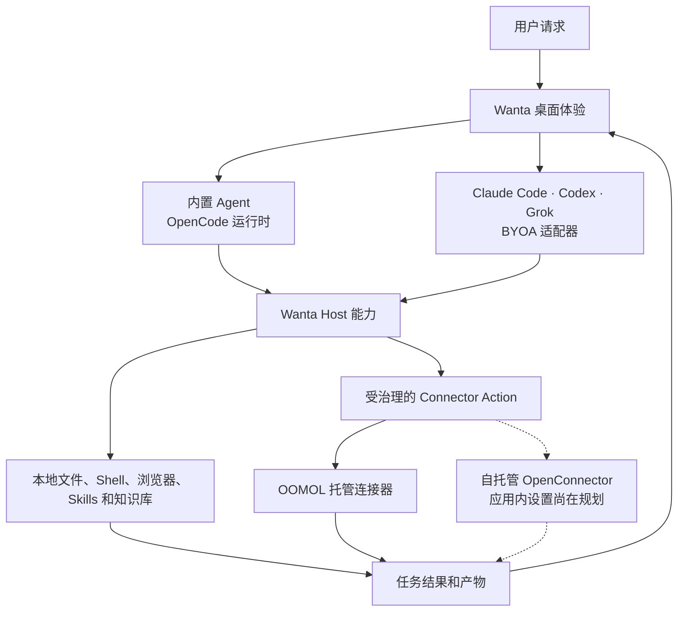

<div align="center">

[English](README.md) · **简体中文** · [日本語](README.ja.md) · [Español](README.es.md) · [한국어](README.ko.md)


# Wanta

**一个开放的桌面 Agent Host：使用你的模型、你的 Agent、你的工作应用和你的团队权限。**

使用 Wanta 托管模型或自己的 OpenAI-compatible API Key 运行内置 Agent，也可以直接接入本机
已经登录的 Claude Code、Codex 和 Grok，继续使用它们原生的模型目录、账号和额度。Wanta 为不同
Agent 提供统一的跨平台工作环境，包括本地工具、Skills、浏览器、知识库、受治理的应用连接、
可见的执行过程和任务产物。Wanta 可连接 1,400+ 个常用 App，让你日常使用的服务都能进入同一套
Agent 工作流。

[网站](https://wanta.ai/) · [OpenConnector](https://github.com/oomol-lab/open-connector) ·
[文档](docs/project-overview.md) · [开发指南](docs/development.md)

[](LICENSE)


</div>

<p align="center">
  
</p>

<p align="center"><em>在同一个工作区中，从连接服务任务直接生成可复用、可交互的产物。</em></p>

<p align="center"><strong>BYOK 模型 · BYOA Agent · 1,400+ 常用 App · 团队权限规则</strong></p>

## 为什么选择 Wanta

Wanta 由 [OOMOL](https://oomol.com/) 打造，面向希望掌握完整 Agent 技术栈的用户和开发者，
而不是将模型、Agent Harness、应用集成和权限绑定在一个封闭产品里。

| 你掌握的部分     | Wanta 提供的能力                                                                                                     |
| ---------------- | -------------------------------------------------------------------------------------------------------------------- |
| **你的模型**     | 使用 Wanta 托管模型，或通过自己的 OpenAI-compatible API Key 运行内置 Agent。                                         |
| **你的 Agent**   | 在同一个桌面 Host 中使用内置 Agent、Claude Code、Codex 或 Grok；外部 Agent 保留原生的本机账号、模型和额度。          |
| **你的工作应用** | 连接覆盖日常工作场景的 1,400+ 个常用 App，并渐进式发现 10,000+ 个预构建 Action，无需将成千上万个工具塞进模型上下文。 |
| **你的团队**     | 在个人和团队工作区间切换，共享 Connections 与 Skills，并通过具名权限规则控制成员可用的 Action。                      |

Wanta 负责可移植的 Host 能力：项目、本地工具、Skills、浏览器、知识库、Connections、权限、
可见的工具活动和任务产物。每个外部 Agent 则保留自身独特的原生能力。界面只展示 Agent 实际声明
支持的控制项，不会假装所有 Agent 都具有相同能力。

Wanta 同时也是可复用的开源桌面基础。你可以 Fork 它，替换提示词、工具、连接器、界面和品牌，
然后发布适合自己产品或工作流的 Agent。

你也可以直接使用 Wanta：通过自己的 OpenAI 兼容模型在本地运行，或者登录使用 OOMOL
托管的模型、连接器、OAuth 授权和团队工作区。

## 为什么我们开源 Wanta

一个有说服力的 Agent 演示可以从模型和聊天输入框开始，但一个真正可靠的桌面 Agent
还需要更多：运行时生命周期管理、流式事件、本地访问控制、安全的模型凭据、会话与项目、
工具活动、文件产物、故障恢复、应用打包，以及让自主工作过程清晰可见的界面。

开发者不应该在打造 Agent 独特能力之前，先把这些全部重做一遍。Wanta 开放了完整的桌面
基础，使你能够：

- 在同一个能力驱动的桌面体验中托管多种 Agent 运行时；
- 构建特定领域的工具、Skills、提示词和工作流；
- 将本地计算机操作与已授权的 SaaS 操作结合起来；
- 分发带有自己品牌的桌面产品，而不只是开发者原型；
- 自主选择需要运营多少基础设施。

## 你可以构建什么

Wanta 目前是一个通用工作 Agent，但其架构从一开始就面向定制。它可以成为运营 Agent、
研究 Agent、客服 Agent、电商 Agent、企业知识 Agent、内部工具，或其他垂直领域桌面产品。

| 从这里开始                                             | 打造你的产品                              |
| ------------------------------------------------------ | ----------------------------------------- |
| 内置 OpenCode 运行时及 Claude Code、Codex、Grok 适配器 | 通过注册表式适配层增加其他编码 Agent      |
| 本地文件、Shell、脚本、搜索和网络访问                  | 为你的产品、行业或内部系统添加工具        |
| OpenAI 兼容的自定义模型和 OOMOL 托管模型               | 引入自己的模型目录和默认提供商            |
| 流式聊天、工具活动、审批、提问和附件                   | 保留运行时集成，同时重新设计工作流        |
| 生成内容的产物处理                                     | 添加产品特定的输出、预览和操作            |
| 跨平台 Electron 打包和更新                             | 应用自己的名称、标识、分发和发布流程      |
| 兼容 OpenConnector 的 SaaS 操作发现与执行              | 连接自己的 Provider，或使用托管连接器生态 |

## 查看 Wanta 的实际表现

Wanta 可以直接推理、检查项目与文件、运行命令和脚本、访问网络，并在任务需要私有账户
数据时调用已授权的 SaaS Action。工具执行过程会流式展示在对话中，让用户看到 Agent
正在做什么。

高风险本地操作必须经过明确的权限流程。Agent 也可以在缺少任务信息时通过结构化问题暂停。
Build 和 Plan 模式提供不同的执行约定，用户可以为任务选择模型、推理级别、项目和访问模式。

生成的文件会始终附加在任务中，而不会消失在对话里。Wanta 可以在产物面板中打开并查看
代码、文本、图片、PDF、Word 文档和完整的交互式电子表格工作簿。

可选的托管体验还提供受管理的账户连接和团队工作区，同时不会将已存储的 Provider 凭据交给 Agent。
团队可以共享 Connections 和 Skills、创建多个具名权限规则、分配成员、为每条规则限制 Action，
并管理用量，而无需自行运营身份认证、OAuth 凭据和治理基础设施。

## 带上你自己的 Agent

Wanta 内置四种 Agent 选择：内置 Agent、Claude Code、Codex 和 Grok。内置 Agent 使用 Wanta 的
模型目录并支持 BYOK；外部 Agent 通过自己的本机 CLI 认证，只使用各自原生的 Provider 路由、
模型目录和用量额度。Wanta 不会将自己的账号 Token、BYOK Key、Base URL 或模型别名注入外部 Agent。

| Agent       | 模型和账号归属                                   | Wanta Host 能力                                           |
| ----------- | ------------------------------------------------ | --------------------------------------------------------- |
| 内置 Agent  | Wanta 托管模型或你的 OpenAI-compatible BYOK 配置 | 完整的 Wanta 运行时与 Host 集成                           |
| Claude Code | 你的本机 Claude Code 账号和原生模型目录          | 项目、Skills、Connections、浏览器、知识库、权限和任务产物 |
| Codex       | 你的本机 Codex 账号和原生模型目录                | 项目、Skills、Connections、浏览器、知识库、权限和任务产物 |
| Grok        | 你的本机 Grok 账号和原生模型目录                 | 项目、Skills、Connections、浏览器、知识库、权限和任务产物 |

BYOA 层采用规范化、默认拒绝的适配器契约。新的 ACP 集成通过注册表接入，能力声明和契约测试则确保
运行时行为与界面控制项始终真实一致。

## 连接你的工作应用

Wanta 通过 OpenConnector 共享生态连接 1,400+ 个常用 App，覆盖沟通协作、生产力、开发工具、
数据分析、电商、存储等日常使用场景，并提供 10,000+ 个预构建 Action。它不会在每个 Prompt 中
注册一整面 Provider 工具墙，而是让 Agent 渐进式列出可用应用、搜索 Action、检查 Schema、
验证输入，并通过选定的 Connector 边界执行。

Provider OAuth Token 和 API 凭据始终保留在 OOMOL Connector 或你的 OpenConnector 部署中。
Agent 只接收完成任务所需的元数据和结果，不会获得已存储的 Provider 密钥。内置 Agent、
Claude Code、Codex 和 Grok 都使用同一套受治理的工作流。

## 以团队规则治理工作

你可以在个人空间和多个团队工作区之间切换，而不会混用会话、Connections、Skills 或权限。
团队创建者和管理员既可以把一个 Connection 共享给整个团队，也可以创建具名规则、分配成员、
为每条规则限制允许使用的 Action，并配置受支持的 Provider 专属访问范围。普通成员只能看到
策略允许的 Connections。

异常权限策略会失败关闭；并发编辑采用版本保护写入，避免旧编辑器静默覆盖新的权限变更。

## 选择适合你的方案

Wanta 将开源桌面基础与可选托管服务分开。你可以根据自己希望运营的内容选择方案。

| 你的目标                                 | 推荐方案                                                                  |
| ---------------------------------------- | ------------------------------------------------------------------------- |
| 使用自己的模型运行私有桌面 Agent         | 使用 **Local BYOK** 工作区，无需 Wanta 账户。                             |
| 为自己的产品构建桌面 Agent               | Fork Wanta 并定制 Agent、工具、模型、UI 和品牌。                          |
| 连接自己的 OpenConnector 部署            | 目前可针对兼容端点构建发行版；应用内自托管 OpenConnector 设置仍在规划中。 |
| 使用托管模型和已认证的 SaaS 连接         | 登录 Wanta，使用 OOMOL 托管服务。                                         |
| 与团队共享连接器、Skills、访问权限和用量 | 使用托管的 Wanta 团队工作区。                                             |

### 运行模式

| 模式                 | 是否需要账户       | 模型                                                       | 本地工具 | 连接器               | 团队功能   |
| -------------------- | ------------------ | ---------------------------------------------------------- | -------- | -------------------- | ---------- |
| Local BYOK           | 否                 | 内置 Agent + OpenAI-compatible Provider                    | 支持     | 不可用               | 否         |
| Wanta 托管           | 是                 | 内置 Agent 使用 OOMOL 模型或 BYOK；BYOA Agent 使用原生账号 | 支持     | OOMOL Connector 生态 | 支持       |
| 自托管 OpenConnector | 应用内支持尚在规划 | 与模型和 Agent 选择相互独立                                | 支持     | 规划中               | 由部署决定 |

退出登录或 OOMOL 会话过期后，本地会话、项目和模型设置仍然可用。Wanta 不会在未告知的
情况下将本地会话上传到 OOMOL 团队工作区。

当前的 `WANTA_ENDPOINT` 选项是**构建时发行版设置**，而不是终端用户可在运行时切换的
选项。它决定的是完整的兼容服务环境，而不仅是连接器 Base URL。应用级 Base URL 和可选
Runtime Token 的自托管 OpenConnector 流程目前只是即将推出的产品界面，尚未完成。

## 定制并发布你自己的桌面 Agent

Wanta 将 OpenCode 作为内置 Agent 的固定版本运行时，并通过 BYOA 适配层支持外部 Agent。
桌面主进程负责会话路由和可移植的 Host 能力；每个适配器则保留其确实支持的运行时原生能力。

### Agent 引擎：OpenCode

应用会将固定版本的 `opencode-ai@1.18.21` 二进制文件作为仅监听回环地址的
`opencode serve` Sidecar 启动，并通过 `@opencode-ai/sdk@1.18.21` 驱动它。OpenCode
软件包采用 MIT 许可证，详情见 [THIRD_PARTY_NOTICES.md](THIRD_PARTY_NOTICES.md)。
Wanta 将运行时、SDK 和插件固定为完全相同的版本，因为其 API 不被视为稳定接口。

最重要的扩展点包括：

| 领域                         | 从这里开始                                                           |
| ---------------------------- | -------------------------------------------------------------------- |
| Agent 身份和运行约定         | [`electron/agent/system-prompt.ts`](electron/agent/system-prompt.ts) |
| Agent 模式、模型、工具和权限 | [`electron/agent/config.ts`](electron/agent/config.ts)               |
| 连接器和特定领域工具         | [`electron/agent/tool-sources.ts`](electron/agent/tool-sources.ts)   |
| 内置和自定义模型支持         | [`electron/models/`](electron/models/)                               |
| 聊天和产物体验               | [`src/routes/Chat/`](src/routes/Chat/)                               |
| 连接体验                     | [`src/routes/Connections/`](src/routes/Connections/)                 |
| 应用标识                     | [`electron/branding.ts`](electron/branding.ts)                       |

Agent 能力是一套在三个位置表达的产品约定：已启用工具、权限规则和系统提示词。请同步修改
三者，确保运行时行为、安全性和 UI 预期保持一致。在更改这些边界之前，请阅读
[架构指南](docs/architecture.md)和[代码规范](docs/conventions.md)。

## 工作原理



Wanta 不会在模型上下文中注册数百个 Provider 专用工具，而是采用渐进式发现：

```text
列出已连接应用 → 搜索 Action → 检查其 Schema → 使用验证后的参数调用
```

这样既能保持较小的工具面，又能让 Action 约定清晰明确，并使授权失败以结构化产品状态
返回，而不是变成自由文本模型回复。

### OpenCode、OpenConnector、Wanta 与 OOMOL

- **OpenCode** 是 Wanta 内置 Agent 的固定版本运行时。Wanta 管理其生命周期，并提供模型、
  配置、权限、提示词和自定义工具。
- **Claude Code、Codex 和 Grok** 是 BYOA 运行时。它们保留原生的本机认证、模型目录、额度和
  Agent 行为，同时获得可移植的 Wanta Host 能力。
- **OpenConnector** 是用于构建和运行共享连接器生态中 Provider 的开源姊妹项目。
- **Wanta** 是桌面 Agent 产品，也是此仓库中可复用的应用基础。
- **OOMOL** 提供可选托管层，包括登录、模型、连接器凭据、OAuth、团队、Skills、用量、
  计费和分发。

Local BYOK 核心功能不需要 OOMOL 账户。登录会启用托管连接器和团队层；查看、Fork 或开发
桌面应用本身不需要登录。

完整的进程、信任边界、IPC、流式传输、认证和存储设计请参阅
[架构指南](docs/architecture.md)。

## 从源码运行

要求：Node.js 22.22.2 或更高版本，以及通过 Corepack 使用 pnpm。Node.js 25 及更高版本不再
内置 Corepack；如果系统中没有 `corepack`，请先安装：

```bash
npm install --global corepack@latest
```

```bash
git clone https://github.com/oomol-lab/wanta.git
cd wanta
corepack pnpm install
corepack pnpm run dev
```

这是试用仓库的最短路径。环境配置、测试命令、运行时验证、打包、签名和发布工作流详见
[开发指南](docs/development.md)。

## 安全与数据边界

- OpenCode 仅监听回环地址，并使用随机的单进程服务器密码。
- OOMOL 会话 Token 和自定义模型 API Key 分别存储，并拥有独立的生命周期。
- 自定义模型密钥使用 Electron `safeStorage` 加密，且绝不会返回到渲染进程。
- Claude Code、Codex 和 Grok 通过各自的本机 CLI 认证；Wanta 不读取或存储其原始凭据。
- 连接器凭据保留在所选的托管或自运营连接器环境中；Agent 只接收操作结果，不会接收
  已存储的 Provider 凭据。
- 高风险本地操作会触发 Wanta 的明确审批界面。
- 本地会话不会在未告知的情况下上传到 OOMOL 团队工作区。

私密漏洞报告方式请参阅 [SECURITY.md](SECURITY.md)，完整信任边界请参阅
[架构指南](docs/architecture.md)。

## 项目结构

| 路径                                       | 用途                                    |
| ------------------------------------------ | --------------------------------------- |
| [`electron/`](electron/)                   | 主进程、Preload、Agent 运行时和桌面服务 |
| [`src/`](src/)                             | React 渲染进程、路由、Hooks 和 UI 组件  |
| [`scripts/`](scripts/)                     | 开发、二进制准备、打包和发布支持        |
| [`resources/`](resources/)                 | 品牌和应用内打包资源                    |
| [`docs/`](docs/)                           | 产品、架构、开发、规范和决策记录        |
| [`.github/workflows/`](.github/workflows/) | Pull Request 和发布自动化               |

技术栈包括 Electron 42、Vite 8、React 19、Tailwind CSS 4、OpenCode、TypeScript、
Vitest、oxlint 和 oxfmt。Wanta 可打包为 macOS、Windows 和 Linux 应用。

## 文档

- [项目概览](docs/project-overview.md) — 产品范围和生态关系
- [架构](docs/architecture.md) — 进程、Agent 运行时、IPC、流式传输、认证和数据流
- [开发指南](docs/development.md) — 安装、运行、测试、打包、签名和发布
- [代码规范](docs/conventions.md) — 实现规则和安全边界
- [关键技术决策](docs/key-decisions.md) — 架构为何如此设计
- [贡献指南](CONTRIBUTING.md) — 分支、Pull Request、验证和贡献规则
- [安全策略](SECURITY.md) — 私密漏洞报告
- [商标政策](TRADEMARKS.md)和[第三方声明](THIRD_PARTY_NOTICES.md)

## 参与贡献

欢迎提交 Issue 和 Pull Request。在进行较大的行为或 UI 更改之前，请先创建 Issue，以便
共同确定产品方向和范围。提交 Pull Request 前请阅读 [CONTRIBUTING.md](CONTRIBUTING.md)；
其中包含仓库工作流、必要验证，以及贡献必须遵守的安全边界。

提交贡献即表示你同意，除非以书面形式明确另行说明，否则该贡献将采用 Apache License 2.0。

## 许可证范围

除非另有说明，本仓库创作的源代码、脚本、测试和文档均采用
[Apache License 2.0](LICENSE)。

此许可证不授予任何第三方产品、服务、API、商标、商号、标志、图标、截图或其他材料的
权利，这些内容仍归各自权利人所有。第三方名称和资源仅用于识别和互操作；收录它们并不表示
任何认可、赞助或合作关系。
